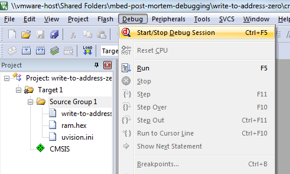
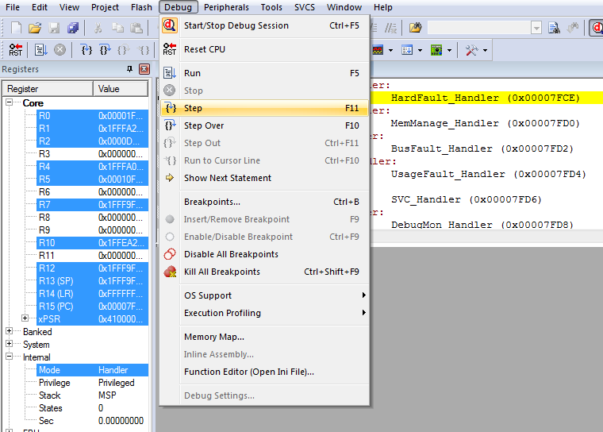
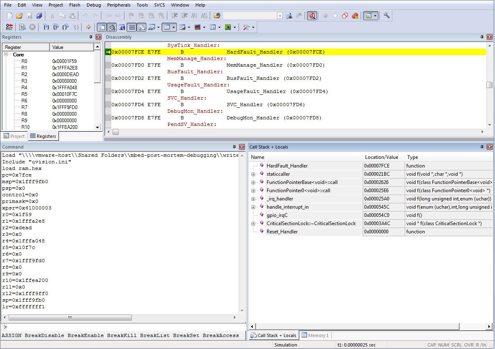
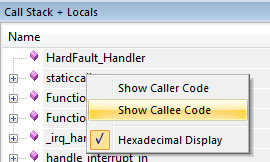
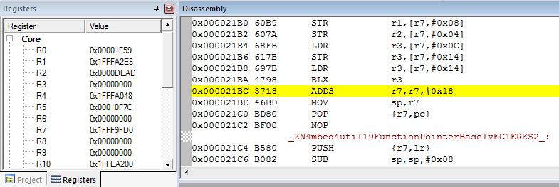
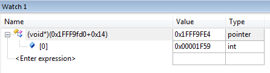
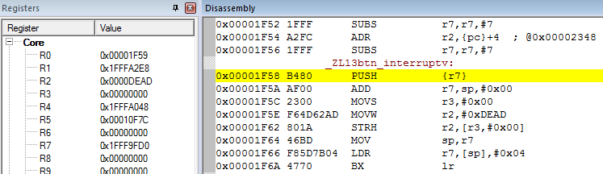

# Debugging a crashed device with mbed OS and uVision 5

When it comes to programming microcontrollers the one scenario that you never want to face is a device that suddenly hangs. It's already very frustrating while you're developing software, and tracing down these bugs can be very time-consuming; it's even worse when the device is already deployed in the field. Replicating the exact conditions in which the device failed can be almost impossible in the lab, especially when the failure manifestates itself after months.

Fortunately mbed-enabled hardware ships with [CMSIS-DAP](https://developer.mbed.org/handbook/CMSIS-DAP) or it's successor DAPLink, which allows you to directly hook into devices via the built-in USB ports (on developer boards), or via a debugging probe like [SWDAP](https://developer.mbed.org/teams/mbed/wiki/SWDAP). CMSIS-DAP is responsible for mounting your mbed OS board as a mass-storage device for easy flashing, but it can also be used to dump the RAM and ROM of a running device, thus enabling you to do post-mortem debugging on a crashed device.

In this blog post we'll show you how to install all dependencies, crash a device, and subsequently do a post-mortem debug session. To follow along you'll need:

1. [A development board](https://www.mbed.com/en/development/hardware/boards/) capable of running mbed OS.
1. [yotta](http://yottadocs.mbed.com/#installing) - to build faulty firmware.
1. [ARM KEIL uVision 5](http://www2.keil.com/mdk5/install/) - to load the debug session. On OS/X or Linux, run uVision in VMWare Fusion, it won't install in VirtualBox.

This article assumes knowledge of building applications for mbed OS. If you're unfamiliar with mbed OS, read [Running your first mbed OS application](https://docs.mbed.com/docs/getting-started-mbed-os/en/latest/FirstProjectmbedOS/) first.

## Creating a program that crashes

Here's an application that writes to a pointer at address 0x0 when the button at `SW2` is triggered. In most devices the ROM starts at address 0x0, and writing to ROM is not allowed, so the core hard faults.

```cpp
#include "mbed-drivers/mbed.h"

// change this to reflect a button on your own board
static InterruptIn btn(SW2);

static void blinky(void) {
    static DigitalOut led(LED1);
    led = !led;
}

static void btn_interrupt() {
    *(uint16_t*)0 = 0xDEAD;
}

void app_start(int, char**) {
    minar::Scheduler::postCallback(blinky).period(minar::milliseconds(500));

    btn.fall(&btn_interrupt);
}
```

Build this application with debug symbols enabled (via `yt build -d`) and flash it on your device. The LED should start blinking until you hit `SW2` and the device freezes.

## Starting a post-mortem debug session

For convenience we created a Python script which can pull the data off the device, and create a uVision 5 project in a single command. Download [dump-firmware.py](https://github.com/janjongboom/mbed-post-mortem-debugging/blob/master/crashing-app/dump_firmware.py) and store it in the same directory as your mbed OS project.

> If you use virtualenv to run yotta, run this script in the same virtualenv environment. On Windows, run this script from 'Run yotta' in your start menu.

Run the script with the crashed device plugged in:

```bash
write-to-address-zero $ python dump_firmware.py
[1/6] Using build directory 'build/frdm-k64f-gcc/source/', verifying build...
[2/6] Build verified. Connecting to board...
[3/6] Board recognized as k64f. Downloading ROM...
[4/6] Dumped ROM. Downloading RAM...
[5/6] Dumped RAM. Creating uVision project...
[6/6] Done. Open 'crashdump/write-to-address-zero.uvprojx' in uVision 5 to debug.
```

A crashdump folder is now created which contains debug symbols, the RAM and ROM of the device, and a uVision 5 project file. Double click on the project file to open uVision.

## Loading the session in uVision 5

> Unfortunately you might not be able to run the debug session in a unlicensed version of uVision 5, depending on the size of your RAM.



In uVision, choose Debug > Start/Stop Debug Session to start.



In the Disassembly panel we see that we're in the `HardFault_Handler`, which is expected. We can drill down into the stack, by selecting Debug > Step.



Now we get more information about the state of the application. On the right bottom corner we see the Call Stack that led up to the crash. We can see we passed an interrupt on a GPIO port (`gpio_irqC`), going through an InterruptIn handler (`handle_inerrupt_in`), and then through a function pointer with zero arguments and return type `void` (`FunctionPointer0<void>`). Although this does not point us straight at the name of the calling function, it helps us pinpoint which functions in our application could be the culprit. Let's look at some assembly.



Right click on 'staticcaller', and select 'Show Callee Code'. We now jump into the disassembled source.



If you're lucky, you jump straight into the function that crashed. Unfortunately this is not the case. Apparently the function managed to return before the hard fault happened, which we can see because straight before the crash we see a function call:

```
LDR           r3,[r7,#0x14]   // Load word from memory
BLX           r3              // Branch with Link
```

The value of R7 thus points us in the direction of the actual call that was just made. Open a new watch window, via View > Watch Windows > Watch 1 to find out which function was called...



Add a watch to `(void*)(0x1FFF9fd0 + 0x14)` in the watch window, and inspect the value of the pointer (in this case `0x1f59`). We can now navigate to this value in the disassembly window, and...



We found our function! We're trying to store the value in R2 (`0xDEAD`) in R3 (`0x0`).
